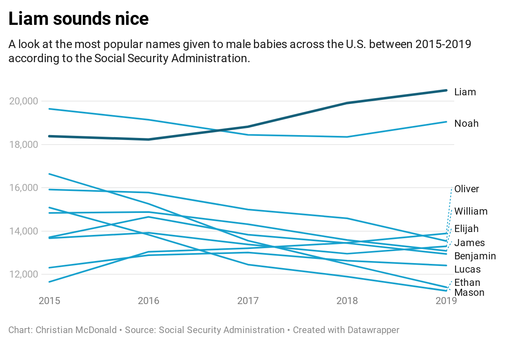
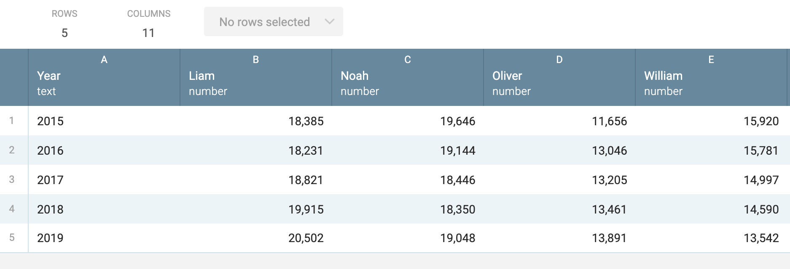

# Workbench Demo

During the Center for Heath Journalism Data Fellowship week I will do a demonstration of some of the features within [Workbench](https://workbenchdata.com/).

We are using the SSN baby names dataset because it is simple yet allows us to explore various Workbench concepts, including reshaping data to create a chart in [Datawrapper](https://www.datawrapper.de/).

## Finished demonstration workflow

In the interest of time, we will start the live demo with an existing workflow and not annotate every step. You can find a [complete Baby Names workflow here](https://app.workbenchdata.com/workflows/114674) with annotations to explain the important steps.

## Overview of skills

The purpose of the demonstration is to give a fast-paced overview of some common abilities and functions within Workbench, including:

- Importing data from various sources.
- Combine files with **Concatenate**. (You can also **Join** data, but we won't demonstrate that here.)
- Use **Refine** to update values in the data.
- Use **Group** to aggregate values.
- Use **Filter** to define specific data we want to use.
- Use **Select columns** to limit the columns we want.
- Use **Reshape** to reconfigure our data for different purposes.

Don't try to follow along on the demo. Just watch.

## Questions we'll answer from the data

- What are the most common baby names over the past five years combined?
- How have more popular names ranked over past five years?

### Import, combine and clean data

- We import the most recent year of data and set the column names.
- We **Concatenate** the five years of data into a single data set.
- Use **Refine** to update the *Sex* values.

### Most common baby names

The tab PopularityAllYears shows this operation.

[This video explains group and aggregate](https://vimeo.com/showcase/7320305/video/435910349).

- Use **Start with tab** from the `Combined` tab.
- Use **Group** and included **Operations** to find the *Total* and *Average Count* of names over five years.
- Use **Sort** to arrange by most common names in 2019.
- Use **Format number** to clean up the `Average Count`.

### Chart of most popular names by year

I'm looking to get the data in a format that can be charted as a [Line chart](https://academy.datawrapper.de/article/23-how-to-create-a-line-chart) in Datawrapper.

This operation takes several reshaping steps to get the result we want. It will seem convoluted if you aren't familiar with reshaping data in this fashion, but it is a very powerful concept to learn.

This is our goal (there are more columns not shown):

- Start with `Combined`.
- **Filter by value** by *Sex* to get just Male values.
- Use **Select columns** to remove the unneeded *Sex* column.
- **Reshape** *Long to wide* with `Name` on *Row columns*. Set the *Variable name* to "Year".
- **Sort** by `2019` values in descending order. *Keep top* 10.
- Use **Reshape** again to *Transpose* the table so names are wide.
- Use **Rename columns** to name our "Year" column.
- Click on **Export** to get the URL for the csv output.

#### Datawrapper

- Start a new Datawrapper graphic.
- Use the URL to get the data.
- In **Refine** step, set the colors of the lines.
- In **Annotate** step, add the headline and descriptions.

### Formulas using Excel concepts

While not really valid for this analysis, we show how you can use **Formula** to sum values from different columns by row.

- Create a **Formula** and use the *Excel* option.
- use `=sum(B1:K1)` to sum the columns as *Total*.

## Data sources

- The baby names data comes from the Social Security Administration. The workflow uses files from the [National data archive listed here](https://www.ssa.gov/oact/babynames/limits.html).
